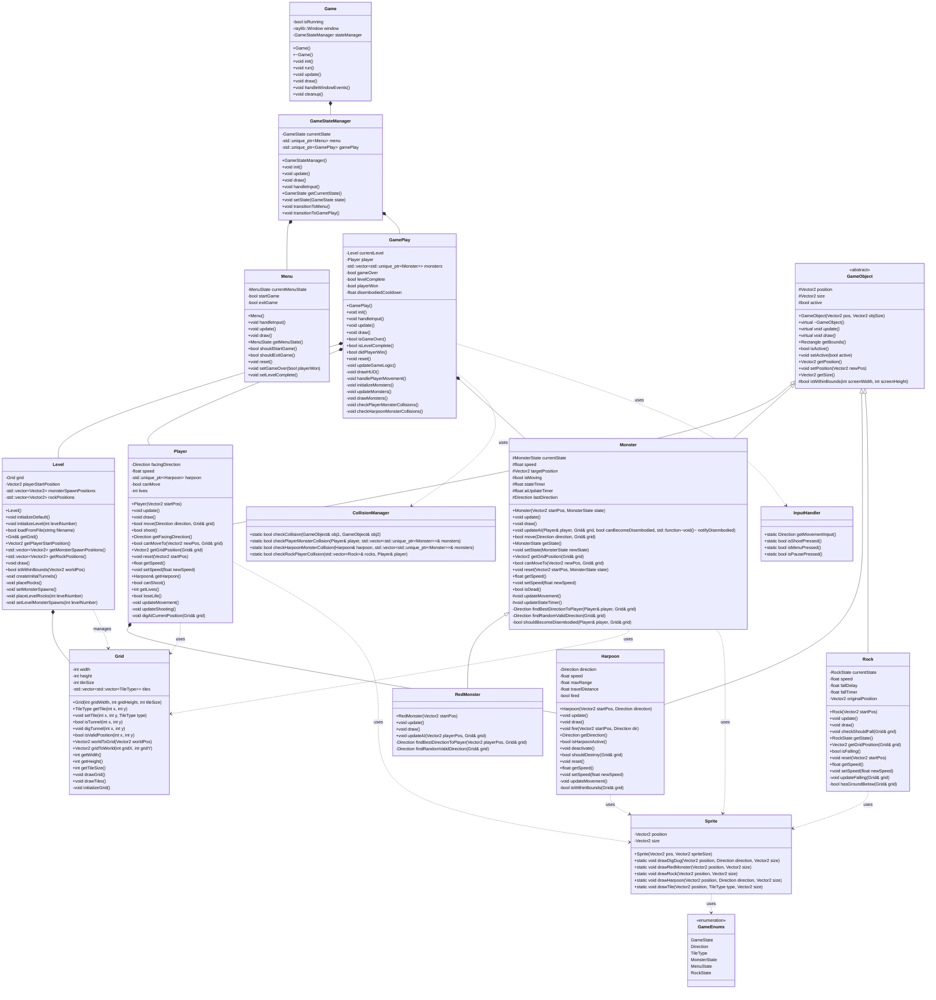
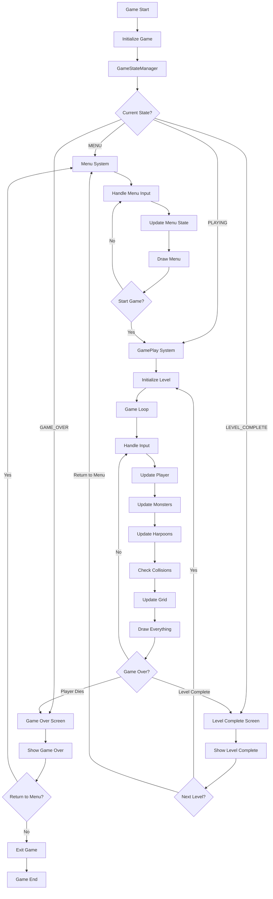
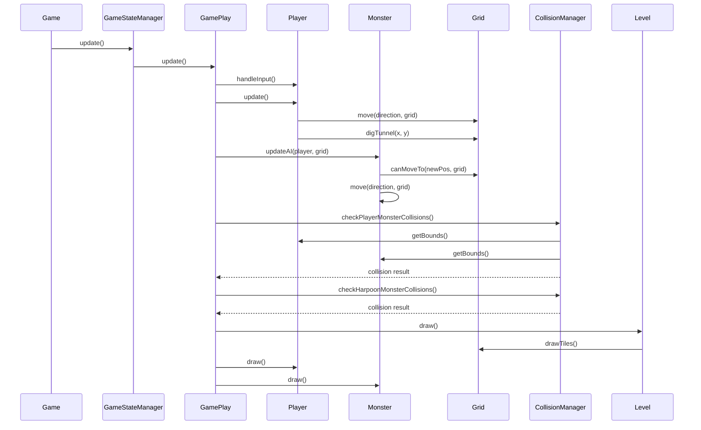

# Galaga/Dig Dug Game Architecture

## Class Diagram

## System Flow Diagram

## Component Interaction Diagram

## Architecture Summary

### Core Components:

1. **Game** - Main game loop and window management
2. **GameStateManager** - Handles transitions between game states
3. **GamePlay** - Main gameplay logic and entity management
4. **GameObject** - Abstract base class for all game entities
5. **Grid** - Underground tunnel/earth system
6. **Level** - Level layout and initialization

### Key Design Patterns:

- **State Pattern**: GameStateManager manages different game states
- **Inheritance**: GameObject hierarchy for common functionality
- **Composition**: GamePlay contains Player, Monsters, Level
- **Static Utilities**: CollisionManager, InputHandler, Sprite rendering
- **Template/Strategy**: Monster AI with different behaviors

### Data Flow:

1. Input → GameStateManager → Current State (Menu/GamePlay)
2. GamePlay manages all entities and game logic
3. Grid system handles tunnel digging and collision detection
4. CollisionManager handles all collision detection
5. Sprite system handles all rendering

This architecture follows good object-oriented principles with clear separation of concerns, inheritance hierarchies, and modular design.
